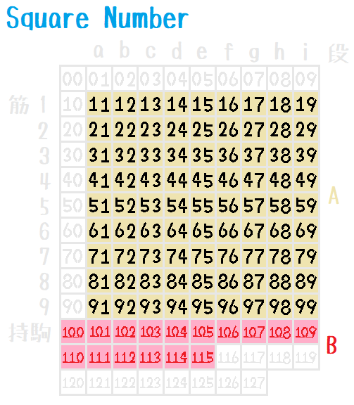
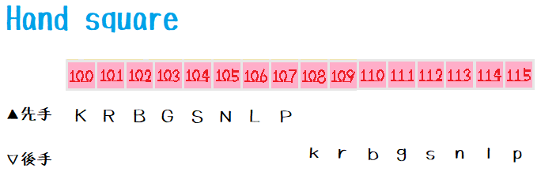
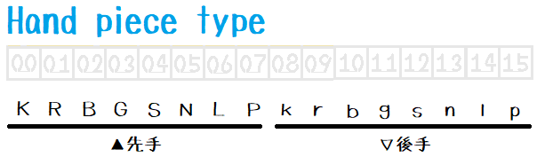
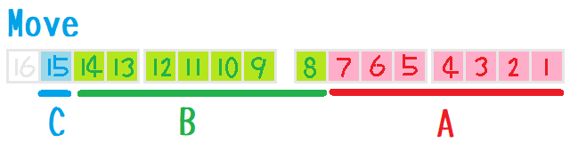

# Design

## Square number

  
  

* `A` - Board
* `B` - Hand

## Hand piece type

  

## l03.Move

  

* `A` - 1～7bit: 移動元(0～127)
* `B` - 8～14bit: 移動先(0～127)
* `C` - 15bit: 成(0～1)
* `move = 0` - 投了
